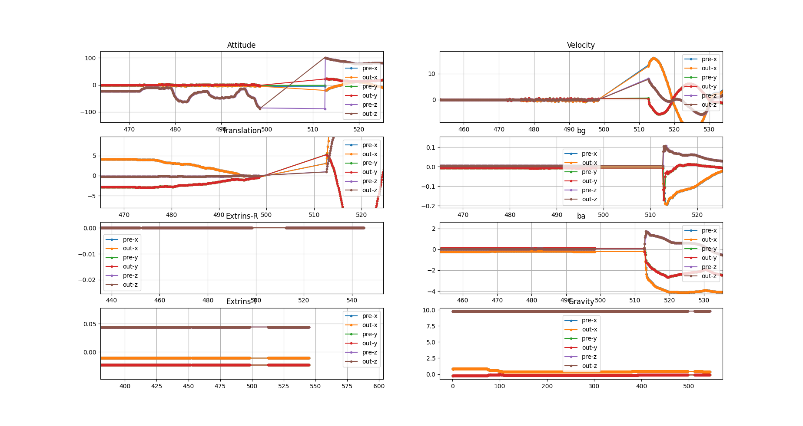
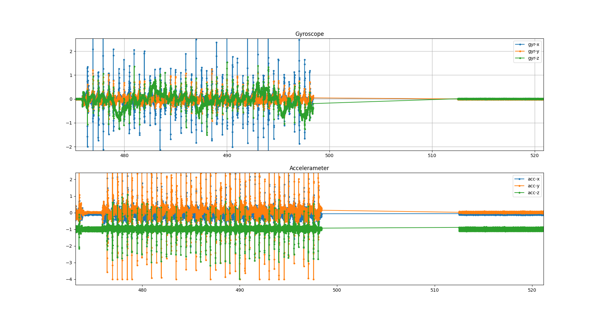

## 记录问题以及更新记录

---

1. 2025.07.04

机器人上联调测试发现了问题：
+ 偶发定位严重延迟（可几十秒）,开机长运行后（几十分钟）出现概率较高
+ 偶发定位异常（位置偏移）

测试、分析log初步定位了问题：
lidar帧率会突然飙升到1000~3000hz(正常为10hz)，而且一帧点云数量非常少（<5)、甚至没有点。
程序目前按10hz处理，帧率突然飙升，导致严重延迟，点云太少会导致定位异常、位置偏移。
> 1751353309.868235374 INFO /laserMapping [/home/unitree/my_slam/src/FAST_LIO/src/laserMapping.cpp:430(sync_packages)] [topics: /rosout, /cloud_registered, /cloud_registered_body, /cloud_effected, /Laser_map, /legOdom, /lidar_path, /full_path, /tf_static] lidar buff size: 7
1751353309.868310714 WARN /laserMapping [/home/unitree/my_slam/src/FAST_LIO/src/laserMapping.cpp:1000(main)] [topics: /rosout, /cloud_registered, /cloud_registered_body, /cloud_effected, /Laser_map, /legOdom, /lidar_path, /full_path, /tf_static] No point, skip this scan!
1751353309.868384807 INFO /laserMapping [/home/unitree/my_slam/src/FAST_LIO/src/laserMapping.cpp:430(sync_packages)] [topics: /rosout, /cloud_registered, /cloud_registered_body, /cloud_effected, /Laser_map, /legOdom, /lidar_path, /full_path, /tf_static] lidar buff size: 6
1751353309.868458899 WARN /laserMapping [/home/unitree/my_slam/src/FAST_LIO/src/laserMapping.cpp:1000(main)] [topics: /rosout, /cloud_registered, /cloud_registered_body, /cloud_effected, /Laser_map, /legOdom, /lidar_path, /full_path, /tf_static] No point, skip this scan!
1751353309.868537023 INFO /laserMapping [/home/unitree/my_slam/src/FAST_LIO/src/laserMapping.cpp:430(sync_packages)] [topics: /rosout, /cloud_registered, /cloud_registered_body, /cloud_effected, /Laser_map, /legOdom, /lidar_path, /full_path, /tf_static] lidar buff size: 5
1751353309.870106848 INFO /laserMapping [/home/unitree/my_slam/src/FAST_LIO/src/laserMapping.cpp:430(sync_packages)] [topics: /rosout, /cloud_registered, /cloud_registered_body, /cloud_effected, /Laser_map, /legOdom, /lidar_path, /full_path, /tf_static] lidar buff size: 4
1751353309.870224897 INFO /laserMapping [/home/unitree/my_slam/src/FAST_LIO/src/laserMapping.cpp:430(sync_packages)] [topics: /rosout, /cloud_registered, /cloud_registered_body, /cloud_effected, /Laser_map, /legOdom, /lidar_path, /full_path, /tf_static] lidar buff size: 3
1751353309.870313450 WARN /laserMapping [/home/unitree/my_slam/src/FAST_LIO/src/laserMapping.cpp:390(sync_packages)] [topics: /rosout, /cloud_registered, /cloud_registered_body, /cloud_effected, /Laser_map, /legOdom, /lidar_path, /full_path, /tf_static] Too few input point cloud!
1751353309.870389654 INFO /laserMapping [/home/unitree/my_slam/src/FAST_LIO/src/laserMapping.cpp:430(sync_packages)] [topics: /rosout, /cloud_registered, /cloud_registered_body, /cloud_effected, /Laser_map, /legOdom, /lidar_path, /full_path, /tf_static] lidar buff size: 2
1751353309.880192378 INFO /laserMapping [/home/unitree/my_slam/src/FAST_LIO/src/laserMapping.cpp:430(sync_packages)] [topics: /rosout, /cloud_registered, /cloud_registered_body, /cloud_effected, /Laser_map, /legOdom, /lidar_path, /full_path, /tf_static] lidar buff size: 19
1751353309.880320856 INFO /laserMapping [/home/unitree/my_slam/src/FAST_LIO/src/laserMapping.cpp:430(sync_packages)] [topics: /rosout, /cloud_registered, /cloud_registered_body, /cloud_effected, /Laser_map, /legOdom, /lidar_path, /full_path, /tf_static] lidar buff size: 18
1751353309.880418046 INFO /laserMapping [/home/unitree/my_slam/src/FAST_LIO/src/laserMapping.cpp:430(sync_packages)] [topics: /rosout, /cloud_registered, /cloud_registered_body, /cloud_effected, /Laser_map, /legOdom, /lidar_path, /full_path, /tf_static] lidar buff size: 17
1751353309.880511717 INFO /laserMapping [/home/unitree/my_slam/src/FAST_LIO/src/laserMapping.cpp:430(sync_packages)] [topics: /rosout, /cloud_registered, /cloud_registered_body, /cloud_effected, /Laser_map, /legOdom, /lidar_path, /full_path, /tf_static] lidar buff size: 16
1751353309.880645698 INFO /laserMapping [/home/unitree/my_slam/src/FAST_LIO/src/laserMapping.cpp:430(sync_packages)] [topics: /rosout, /cloud_registered, /cloud_registered_body, /cloud_effected, /Laser_map, /legOdom, /lidar_path, /full_path, /tf_static] lidar buff size: 15
1751353309.881073681 INFO /laserMapping [/home/unitree/my_slam/src/FAST_LIO/src/laserMapping.cpp:430(sync_packages)] [topics: /rosout, /cloud_registered, /cloud_registered_body, /cloud_effected, /Laser_map, /legOdom, /lidar_path, /full_path, /tf_static] lidar buff size: 14
1751353309.890188043 INFO /laserMapping [/home/unitree/my_slam/src/FAST_LIO/src/laserMapping.cpp:430(sync_packages)] [topics: /rosout, /cloud_registered, /cloud_registered_body, /cloud_effected, /Laser_map, /legOdom, /lidar_path, /full_path, /tf_static, /tf] lidar buff size: 33
1751353309.900167072 INFO /laserMapping [/home/unitree/my_slam/src/FAST_LIO/src/laserMapping.cpp:430(sync_packages)] [topics: /rosout, /cloud_registered, /cloud_registered_body, /cloud_effected, /Laser_map, /legOdom, /lidar_path, /full_path, /tf_static, /tf] lidar buff size: 52
1751353309.910157139 INFO /laserMapping [/home/unitree/my_slam/src/FAST_LIO/src/laserMapping.cpp:430(sync_packages)] [topics: /rosout, /cloud_registered, /cloud_registered_body, /cloud_effected, /Laser_map, /legOdom, /lidar_path, /full_path, /tf_static, /tf] lidar buff size: 71
1751353309.920171231 WARN /laserMapping [/home/unitree/my_slam/src/FAST_LIO/src/laserMapping.cpp:390(sync_packages)] [topics: /rosout, /cloud_registered, /cloud_registered_body, /cloud_effected, /Laser_map, /legOdom, /lidar_path, /full_path, /tf_static, /tf] Too few input point cloud!
1751353309.920288032 INFO /laserMapping [/home/unitree/my_slam/src/FAST_LIO/src/laserMapping.cpp:430(sync_packages)] [topics: /rosout, /cloud_registered, /cloud_registered_body, /cloud_effected, /Laser_map, /legOdom, /lidar_path, /full_path, /tf_static, /tf] lidar buff size: 90
1751353309.930451045 INFO /laserMapping [/home/unitree/my_slam/src/FAST_LIO/src/laserMapping.cpp:430(sync_packages)] [topics: /rosout, /cloud_registered, /cloud_registered_body, /cloud_effected, /Laser_map, /legOdom, /lidar_path, /full_path, /tf_static, /tf] lidar buff size: 127
1751353309.940169119 WARN /laserMapping [/home/unitree/my_slam/src/FAST_LIO/src/laserMapping.cpp:390(sync_packages)] [topics: /rosout, /cloud_registered, /cloud_registered_body, /cloud_effected, /Laser_map, /legOdom, /lidar_path, /full_path, /tf_static, /tf] Too few input point cloud!

