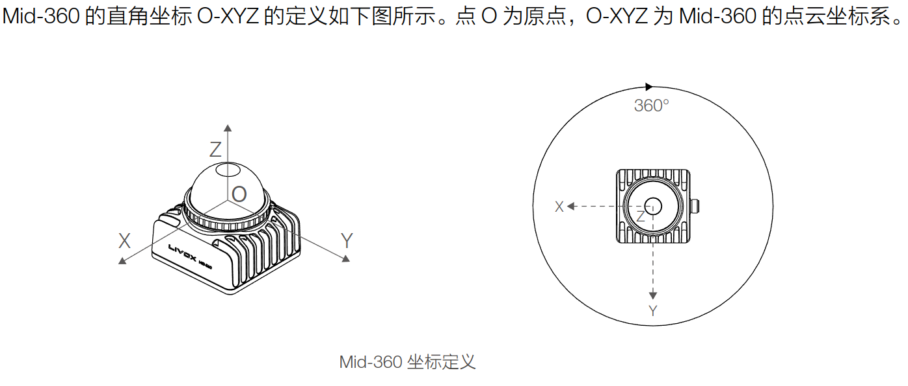
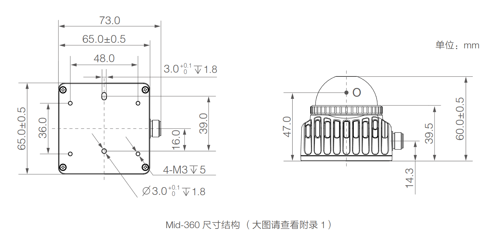
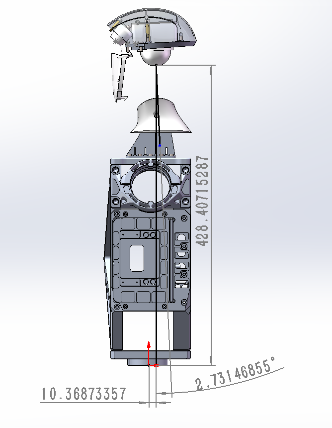
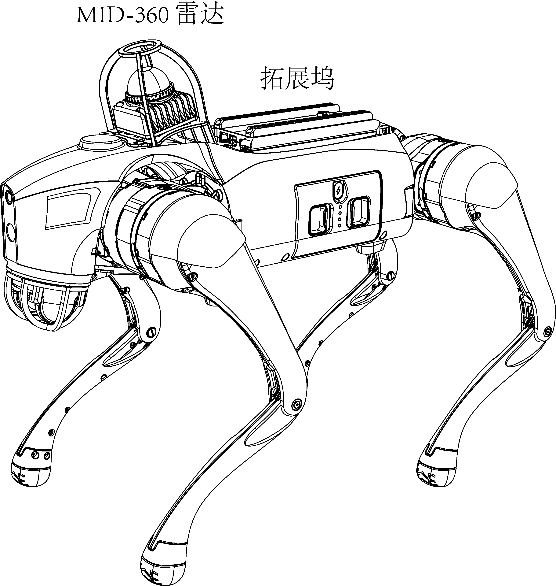

## SLAM坐标系

### 坐标系定义
1. **Lidar局部坐标系("livox")**：如下图
 
 

2. **IMU局部坐标系("body")**: MID-360 IMU和Lidar坐标系方向一致，有微小平移。
3. **odom坐标系（"camera_init")**：IMU初始化后，Z朝上、对齐重力的反方向，X方向为IMU的初始X方向的*固定坐标系*，原点为初始化时IMU的位置。
4. **world坐标系("world")**：构建地图时，X轴朝向机器人正前方（如果有初始绝对定向的话，X对齐正东方向），Y轴朝左，Z轴朝正上方，原点为初始化时IMU的位置。
4. **map坐标系（“map")**: 建图时和world坐标系一致；重定位时为地图的坐标系。
5. **base_link局部坐标系（“base_link")**（暂未使用）：x轴朝机器人正前方，y轴朝左，z轴朝正上方，原点为IMU的位置。
7. **base_footprint坐标系（“base_footprint”）**（暂未使用）：x轴朝机器人正前方，y轴朝左，z轴朝正上方，原点为机器人底盘/足与地面接触区域的中心点。

### Lidar安装位置
+ 宇树G1的MID-360 Lidar安装位置如下图：

+ 宇树Go2-w的MID-360 Lidar安装位置如下图：

